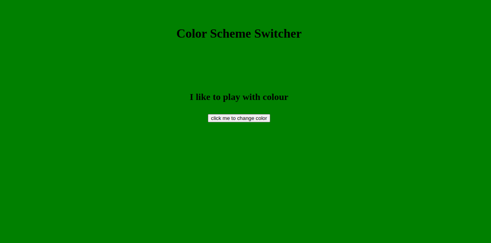

# 🎨 Background Color Changer using JavaScript Event Listener

This simple web app demonstrates how to change the background color of a webpage using JavaScript and event listeners.

## 🌟 Features

- Click a button to change the background color.
- Random colors on each click.
- Lightweight and beginner-friendly code.

## 🖼️ Demo
![Demo Screenshot]

